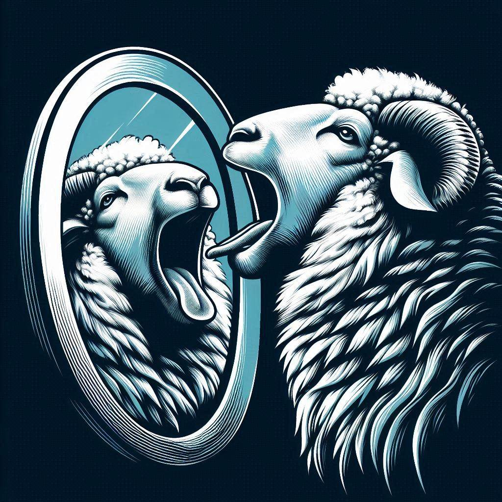

# Dolly: Code Clone Detection using LLMs and GNNs

Dolly is an advanced code clone detection system that leverages the power of Large Language Models (LLMs) and Graph Neural Networks (GNNs) to identify similar code patterns across codebases. This project is part of a tutorial at the BIFOLD Tutorial Day (2025, TU Berlin).

## Overview

Code clone detection is a crucial task in software engineering, helping developers identify duplicated code, potential bugs, and opportunities for refactoring. We focus on software vulnerabilities and showcase how graph-based learning with PyTorch Geometric can be implemented for this task. Also, we include an approach based on LLMs for comparison.

## Setup

*Setup instructions will be provided here once the project structure is finalized.*

## Training

The training process involves two main components:

1. **Language Model Training**
   - Pre-training on code corpora
   - Fine-tuning for clone detection tasks
   - Model optimization and validation

2. **Graph Neural Network Training**
   - Graph construction from code
   - Network architecture training
   - Integration with language model outputs

*Detailed training steps and configurations will be documented here.*

## Evaluation

The project will include comprehensive evaluation experiments to assess:

- Detection accuracy across different types of code clones
- Performance comparison with existing clone detection tools
- Scalability analysis on large codebases
- Impact of different model architectures and parameters

*Evaluation methodology and results will be documented here.*

## License

MIT License, see [LICENSE](LICENSE) for details.